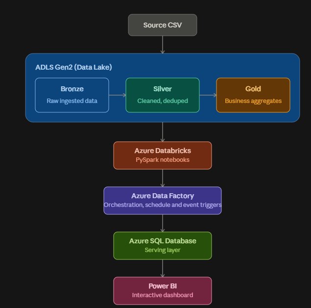
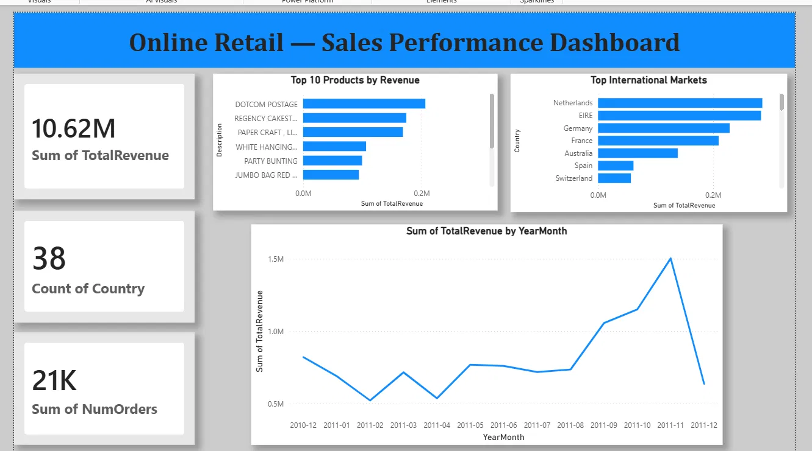

# Azure Retail Data Pipeline

An end-to-end batch data engineering pipeline built on Azure, using the medallion architecture (Bronze → Silver → Gold) to ingest, clean, and aggregate online retail transaction data, then serve it through a SQL database into an interactive Power BI dashboard.

## Problem Statement

Online retailers generate raw, messy transactional data (nulls, cancellations, duplicates) that isn't directly usable for business reporting. This project simulates a real-world scenario: a batch pipeline that ingests raw sales data, cleans and structures it, aggregates it into business-ready metrics, and surfaces it through a dashboard — the kind of pipeline a retail analytics team would rely on for revenue tracking and market analysis.

## Architecture

```
Source CSV (landing zone)
   → Azure Data Lake Storage Gen2 (Bronze — raw)
   → Azure Data Factory (orchestration, Copy Data activity)
   → Azure Databricks / PySpark (Silver — cleaned, deduplicated, split into transactions/returns)
   → Azure Databricks / PySpark (Gold — business aggregates)
   → Azure SQL Database (serving layer)
   → Power BI (visualization)

Orchestration: Azure Data Factory pipeline chains Copy Data → Notebook (Bronze→Silver) → Notebook (Silver→Gold)
Triggers: Schedule trigger (daily) + Storage Event trigger (on new file arrival)
```




## Tech Stack

| Layer | Technology |
|---|---|
| Storage | Azure Data Lake Storage Gen2 |
| Orchestration | Azure Data Factory |
| Transformation | Azure Databricks (PySpark) |
| Serving layer | Azure SQL Database (Free tier) |
| Visualization | Power BI Desktop |
| Dataset | Online Retail II (UCI / Kaggle) |

## Pipeline Walkthrough

### 1. Ingestion (Bronze)
Raw CSV lands in a `bronze` container landing zone. An Azure Data Factory Copy Data activity organizes it into a date-partitioned path (`bronze/retail/YYYY/MM/DD/`), simulating how a real ingestion pipeline structures incoming vendor/source-system drops.


### 2. Transformation — Bronze to Silver
A PySpark notebook in Databricks reads the raw file and:
- Trims whitespace from string columns (prevents silent grouping errors downstream)
- Deduplicates exact-match rows (~5,268 duplicates removed)
- Splits data into two tables: `transactions` (valid sales) and `returns` (cancelled orders, identified by `InvoiceNo` starting with "C")
- Writes both as Parquet to the `silver` container

**Design decision:** ~25% of rows had null `CustomerID`. Rather than dropping this data (which would understate revenue), these rows are retained in the transactions table for revenue-based analysis, and only excluded from customer-specific aggregations.

### 3. Aggregation — Silver to Gold
A second PySpark notebook reads Silver data and produces three business-ready Gold tables:
- `monthly_revenue` — revenue trend by month
- `top_products` — revenue and quantity sold by product
- `country_revenue` — revenue and order count by country

### 4. Orchestration
All steps are chained into a single Azure Data Factory pipeline (Copy Data → Bronze-to-Silver Notebook → Silver-to-Gold Notebook), triggered either on a schedule or automatically when a new file lands in the storage account (Storage Event trigger via Event Grid).

### 5. Serving Layer
Gold tables are loaded into an Azure SQL Database (Free tier) via Spark's JDBC connector, giving downstream tools a simple relational interface instead of querying Parquet files directly.

### 6. Visualization
Power BI Desktop connects directly to the Azure SQL Database and presents:
- KPI cards (Total Revenue, Total Orders, Countries Served)
- Monthly revenue trend line
- Top 10 products by revenue
- Top international markets (UK excluded deliberately, since it dominates the scale and obscures growth in other markets)



## Key Design Decisions

- **Medallion architecture (Bronze/Silver/Gold)** separates raw, cleaned, and business-ready data — each layer can be reprocessed independently without re-ingesting from source.
- **Returns handled as a first-class table**, not discarded — cancellations are legitimate business data (return rate analysis, most-returned products) rather than "bad data."
- **Credentials are never hardcoded** in notebooks. Databricks widgets (`dbutils.widgets`) are used to pass the storage account key and SQL credentials at runtime, keeping secrets out of version control.
- **Free-tier resources used throughout** (Azure SQL Free offer, Databricks single-node cluster with auto-terminate) to keep the project cost-conscious and reproducible on a trial subscription.


## Repository Structure

```
azure-retail-data-pipeline/
├── README.md
├── architecture-diagram.png
├── screenshots/
│   ├── adf-pipeline.png
│   ├── power-bi-dashboard.png
│   ├── sql-query-results.png
│   └── storage-containers.png
├── notebooks/
│   ├── bronze_to_silver.py
│   └── silver_to_gold.py
└── adf-pipeline/
    └── pl_ingest_bronze.json
```
